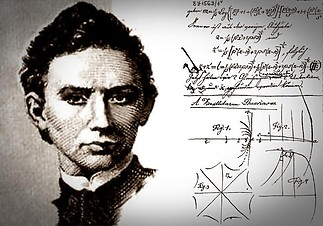

**Dr. Gulyás András** tudományos főmunkatárs a BME Távközlési és Mesterséges Intelligencia Tanszék kutatója

**Dr. Heszberger Zalán**, **Dr. Bíró József**, **Győri Erzsébet** a BME Távközlési és Mesterséges Intelligencia Tanszék mukatársai és **Szénási Sára** vendégszereplő az Irányítástechnika és Informatika Tanszék doktorandusza. 

Az oktatás egyik fő célkitűzése, adott ismeretanyag átadása mellett, hogy az életben nagy eséllyel előforduló problémákhoz hatékony megoldási sémákat ismertessen. Programunk azzal foglalkozik, hogy mi történik ha olyan problémával szembesülünk, amire a tanult sémáink nem működnek? Ilyenkor valamiféle kreatív ötlettel lehet továbbmenni, ám az ilyen ötletek létrejöttéhez sokszor nem tisztán logikai módszerek kellenek. Programunk célja a kreatív gondolkodás természetének élményszerű bemutatása játékok segítségével illetve alkalmazása kutatási feladatokban.

