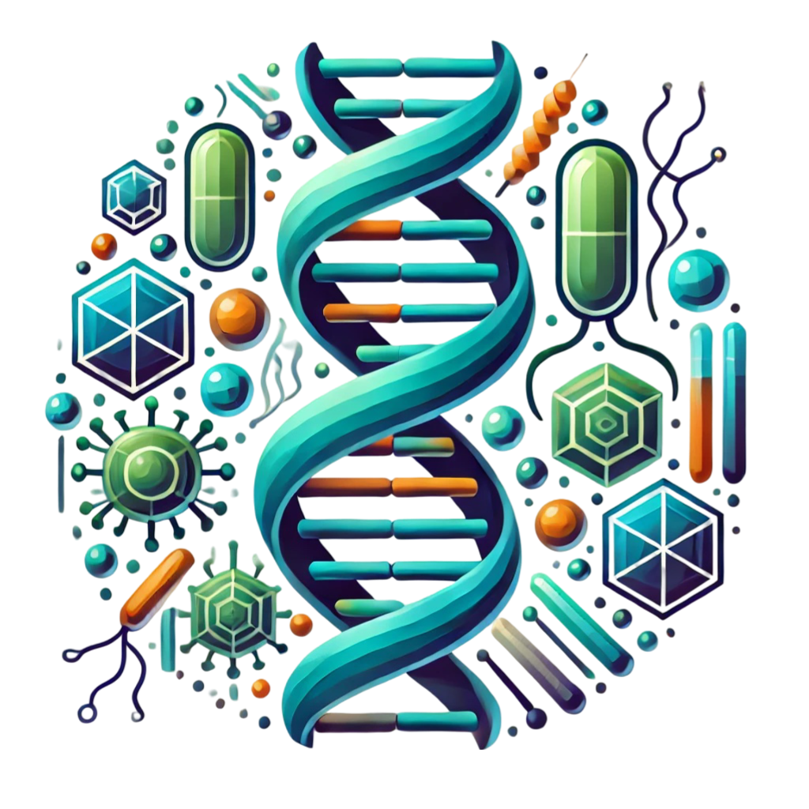

**Dr. Békési Angéla:** A BME VBK ABÉT tanszékén 2021-től vagyok adjunktus, kutatómunkámat a Prof. Vértessy G. Beáta vezette Genom Metabolizmus és Biostruct Kutatócsoportban végzem. Előtte és részállásban jelenleg is ugyanezen kutatócsoportnak a Hun-Ren Molekuláris Élettudományi Intézetében (korábban MTA Enzimológiai Intézetben) működő részlegén kutattam, amit egy ötéves brüsszeli posztdoktori állás szakított meg. Jelenleg funkcionális genomikai kutatásokat végzek a DNS-ben megjelenő nem kanonikus bázisok, különösen az uracil megjelenésére és biológiai szerepére és/vagy felhasználhatóságára vonatkozóan, valamint a biomérnöki MSc képzésben a bioinformatika tárgyat oktatom.

**Emődi Nikolett, Szajkó Milda, Cs. Nagy-Lászlóffy Júlia, Leveles Ibolya, Hirmondó Rita:**
A Genom Metabolizmus és Biostruct Kutatócsoport lelkes fiatal kutatói, doktoranduszai és MSc-s diákjai. A csoport kutatási és oktatási tevékenységéről a honalpjainkon lehet tájékozódni: https://www.biostruct.org/ és https://www.ttk.hun-ren.hu/ei/genom-metabolizmus-kutatocsoport. 

Továbbá a [BME VBK ABÉT insta](https://www.instagram.com/p/C_fSLQoovmX/?igsh=cXBjZ2pkdXh1bDJq) és [facebook oldalán](https://www.facebook.com/share/p/iwCxi83ubJKME1Mr/) találhattok egy rövid bemutatkozást.

Egy interaktív workshopot kínálunk kicsiknek és nagyoknak. A Biostruct labor előtti folyosón installált játékok regisztráció nélkül is kipróbálhatók, közben a laborban a regisztrált érdeklődők bepillantást nyernek egy fehérjekristályosító labor életébe. 

Az esemény a BME Alkalmazott Biotechnológia és Élelmiszertudományi Tanszékén megrendezésre kerülő ["Legyél te is biomérnök!"](https://kutatok.org/abettt/2024/09/04/kutatok-ejszakaja-2024-legyel-te-is-biomernok-programsorozat/) programsorozat része.

