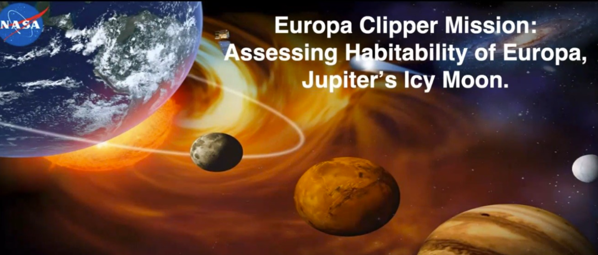

---
layout: collection_kutej
tud_title:  Kutatók éjszakája 2024
tud_intezmeny: BME ÉMK Fotogrammetria és Térinformatika Tanszék
tud_intezmeny_rovid: EMK
tud_latogato: KF
title: Van-e élet a Naprendszerben a Jupiter Europa nevű holdján? (angol nyelvű, magyar felkonferálással) Can Jupiter' icy moon Europa harbour life in our Solar System?
tud_programfelelos: Kugler Zsófia
tud_eloadok:  Dr. Murthy S. Gudipati
tud_tipus: Csak személyes jelenléttel látogatható 
tud_online: 
tud_helyszin: BME K épület F84-es terem, Budapest Műegyetem rkp 3.
tud_idopont: 2024. szeptember 27. 18:00-18:45
tud_regisztracio: 
tud_url: 
tud_reg: nem , nem
date:  2024-08-27
--- 
[Dr. Murthy S. Gudipati](https://science.nasa.gov/people/murthy-gudipati/): Az előadó a NASA kaliforniai Jet Propulsion Laboratory vezető kutató munkatársa, asztrofizikus, a Naprendszerben lévő jég jelenlétét és formáit kutatja.

A földönkivüli élet lehetőségéről tart előadást Dr. Murthy S. Gudipati, a NASA Jet Propulsion Laboratory vezető kutatója. Előadásának fő témája, a két hét múlva felbocsájtásra kerülő Europa Clipper űrszonda, mely az Jupiter Europa nevű holdjának lakhatóságát fogja vizsgálni olyan várható tudományos felfedezésekkel, amelyek a jövőben átírhatják a tankönyveket. Az Europa egy jeges felszínű hold, melynek jégpáncélja alatt hatalmas, folyékony tenger húzódik. Az előadás értékes betekintést nyújt a NASA Jet Propulsion Laboratory-ban végzett élvonalbeli kutatásokba és az univerzumban található, bolygónkon kívüli élet megértésére. Az izgalmas előadás után a közönség közvetlenül kérdéseket tehet fel az előadónak.

