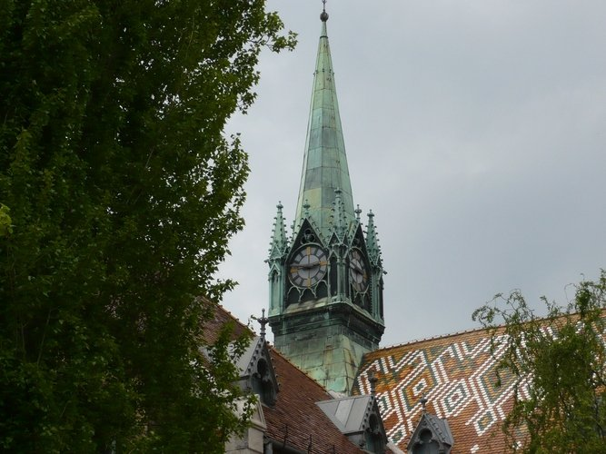

**Bernáth Zsófia:** A tárlatvezetéseim során a résztvevők megismerhetik a könyvtár  működését, történetét, építészeti és művészettörténeti sajátosságait.  

A Kutatók Éjszakáján  a könyvtár rejtett, ritkán látott oldalával ismerkedhetnek meg az érdeklődők. 
A vezetett túrán a könyvtár történeti hátterét, művészettörténeti jelentőségét ismerhetik meg a látogatók.
Az olvasói terek mellett ellátogatunk a raktár területére, ahol a raktározási szempontok ismertetése során különleges könyveket is megtekintünk.  

