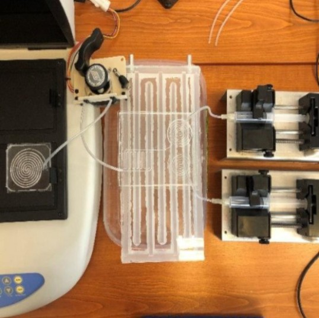

Hogyan kapcsolódik a biológiai minták vizsgálata a villamosmérnöki és gépészeti, vegyészeti tudományokhoz? Mik a mikrovilág törvényszerűségei? Ezekre és még sok érdekes kérdésre kaphatnak választ a résztvevők. 
A mikrofluidikai rendszereket elterjedten alkalmazzák az orvosi, biológiai és kémiai kutatások területén, mert segítségükkel hordozható, kis méretű diagnosztikai eszközöket kaphatunk. 
A mikrofluidikai eszközök hagyományos gyártási technológiáival szemben a 3D nyomtatást kis anyagköltség, rövid gyártási idő és széleskörű alapanyag használat jellemzi. 
Alkalmazásával lehetőség nyílik komplex csatorna-rendszerek megvalósítására, akár háromdimenzióban is. 
A laborlátogatás során bemutatjuk hogy mi is a mikrofluidika, hogyan alkalmazzuk az additív gyártást a mikrofluidikai eszközök kialakítására, és megmutatunk néhány alkalmazási példát is.

[Kovács Rebeka](https://tudprog.bme.hu/kutatok_ejszakaja/profilok/kovacs_rebeka), [Tarpataki Nóra](https://tudprog.bme.hu/kutatok_ejszakaja/profilok/tarpataki_nora)

[BME Villamosmérnöki és Informatikai Kar, Elektronikai Technológia Tanszék](https://www.ett.bme.hu/)

