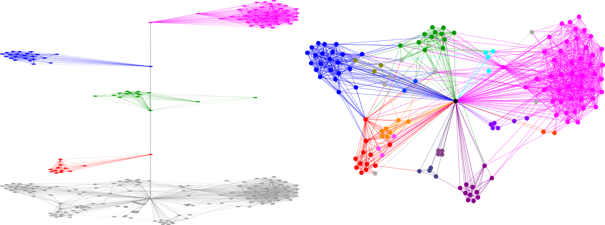

Manapság mindenki a neurális hálókról beszél, pedig a szociális hálózatok igazából fontosabbak számunkra. 
A barátaink, ismerőseink határozzák meg mindennapjainkat, de elgondolkodtunk-e rajta, hogy mégis miként választjuk őket? Milyen szerepe van ebben a saját kis közösségeinknek, vágyainknak? 
Talán a legfontosabb, miért egy fizikus akarja ezt megfejteni?

[Török János](https://tudprog.bme.hu/kutatok_ejszakaja/profilok/torok_janos)

[BME TTK, Elméleti Fizika Tanszék](https://dtp.physics.bme.hu/)

