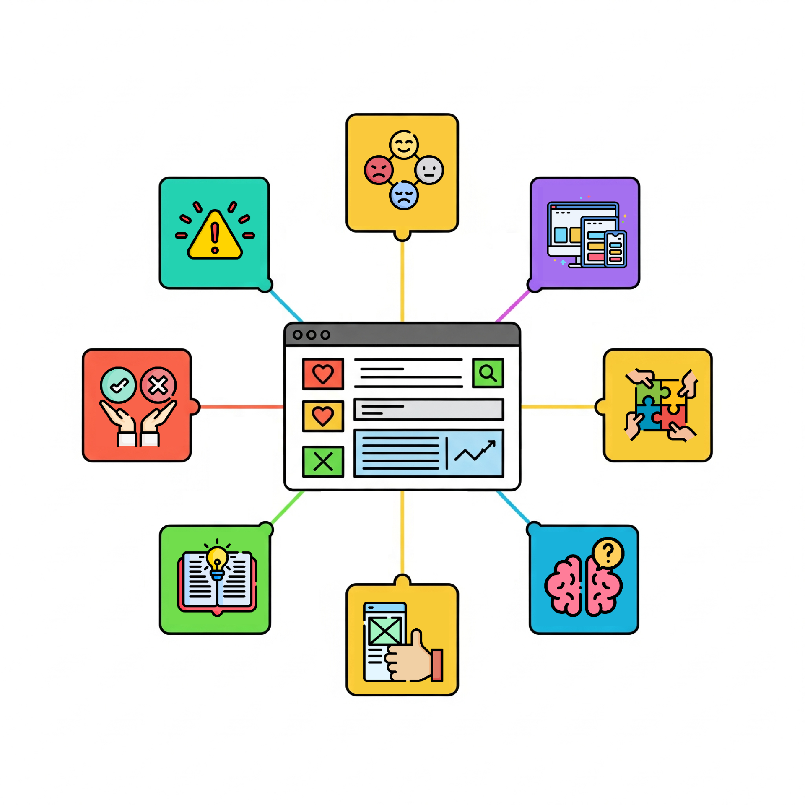

Az alkalom betekintést nyújt a felhasználói felület (UI) tervezés pszichológiai vonatkozásaiba. Különösen ajánlott a pszichológia, a felhasználói élmény (UX) és a UI design iránt érdeklődőknek.

**Bemutató ideje**: 16:00-17:30

[Molnár Marietta](https://tudprog.bme.hu/kutatok_ejszakaja/profilok/molnar_marietta)

BME GTK, [Ergonómia és Pszichológia Tanszék](http://www.erg.bme.hu/)

