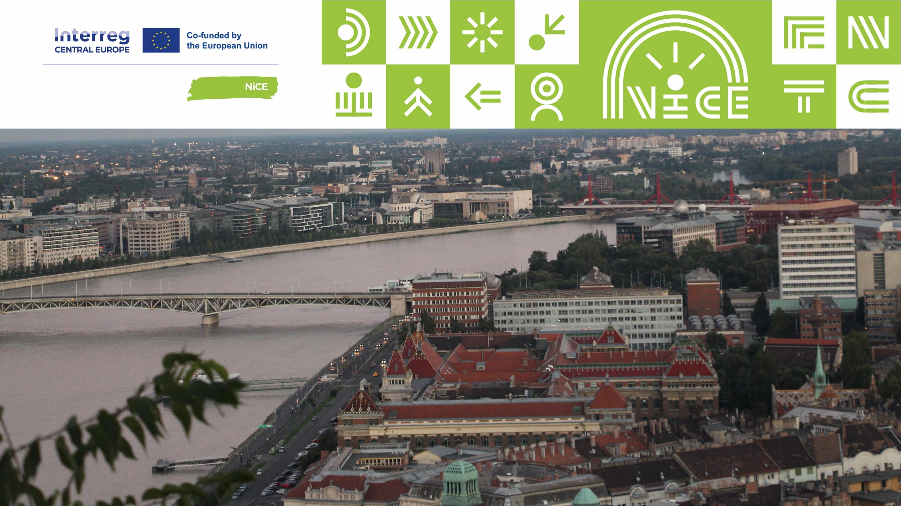

Előadások, beszélgetés a fenntartható üzleti modellekről és könyv-növény cserebere a BME-n! Milyen szerepe van az oktatásnak a fenntarthatóságban?
Milyen területen újulhat meg egy csomagolásmentes bolt és Szemléletformáló és Újrahasználati Központ (SZÚK)? Tapasztalatok első kézből!

*A program a CE0100312 NiCE Interreg Central Europe projekt támogatásával valósul meg.*

[Dr. Szabó Mariann](https://tudprog.bme.hu/kutatok_ejszakaja/profilok/szabo_mariann), [Szalmáné Dr. Csete Mária](https://tudprog.bme.hu/kutatok_ejszakaja/profilok/szalmane_csete_maria), 
[Stieber Balázs](https://tudprog.bme.hu/kutatok_ejszakaja/profilok/stieber_balazs), [Vincze Dorottya](https://tudprog.bme.hu/kutatok_ejszakaja/profilok/vincze_dorottya)

