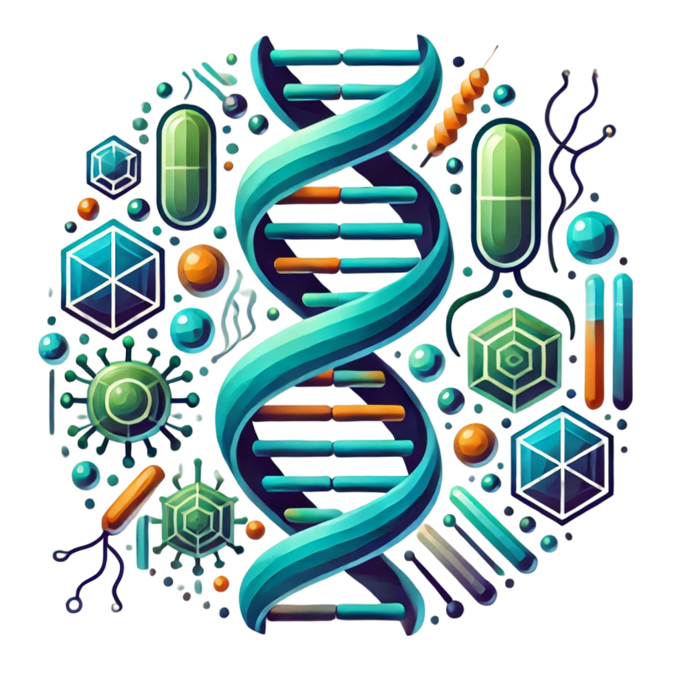

Egy interaktív workshopot kínálunk kicsiknek és nagyoknak. A Biostruct labor előtti folyosón installált játékok regisztráció nélkül is kipróbálhatók, közben a laborban a regisztrált érdeklődők bepillantást nyernek egy fehérjekristályosító labor életébe. 

*A folyosón kiállított játékok regisztráció nélkül kipróbálhatóak.*

[Dr. Békési Angéla](https://tudprog.bme.hu/kutatok_ejszakaja/profilok/bekesi_angela)

**Emődi Nikolett, Iván Réka, Szajkó Milda:** 
A Genom Metabolizmus és Biostruct Kutatócsoport lelkes fiatal kutatói, doktoranduszai és MSc-s diákjai. A csoport kutatási és oktatási tevékenységéről a honalpjainkon lehet tájékozódni: [https://www.biostruct.org/](https://www.biostruct.org/) és [https://www.ttk.hun-ren.hu/ei/genom-metabolizmus-kutatocsoport](https://www.ttk.hun-ren.hu/ei/genom-metabolizmus-kutatocsoport).
Továbbá a BME VBK ABÉT insta és facebook oldalán találhattok egy rövid bemutatkozást: [Instagram](https://www.instagram.com/p/C_fSLQoovmX/?igsh=cXBjZ2pkdXh1bDJq) és [Facebook](https://www.facebook.com/share/p/iwCxi83ubJKME1Mr/)

[BME VBK, Alkalmazott Biotechnológia és Élelmiszertudományi Tanszék](https://kutatok.org/abettt/)

