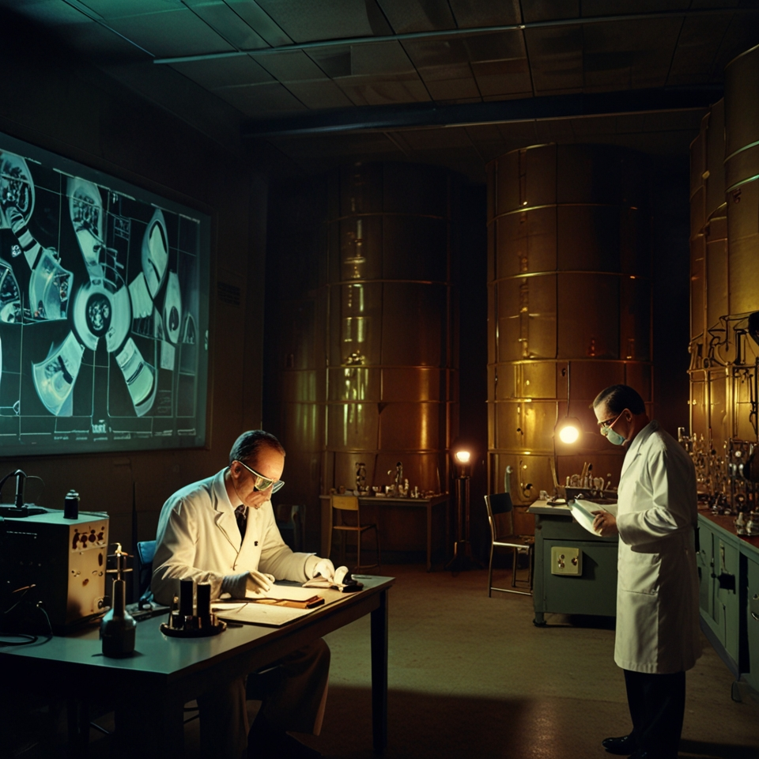

Reaktorok és sugárterápia sugárvédelme - hosszú utat tettünk meg a radioaktivitás felfedezésétől a biztonságos alkalmazásáig. Ma már tudjuk, hogy az ionizáló sugárzás veszélyes lehet, de ez a hőskorban még nem volt nyilvánvaló. 
A biztonságért folytatott küzdelem történetéről szól az előadás.

[Gerdán Mercédesz](https://tudprog.bme.hu/kutatok_ejszakaja/profilok/gerdan_mercedesz), [Gazdag-Hegyesi Szilvia](https://tudprog.bme.hu/kutatok_ejszakaja/profilok/gazdag-hegyesi_szilvia)

[BME TTK, Nukleáris Technikai Intézet](https://www.reak.bme.hu/)

