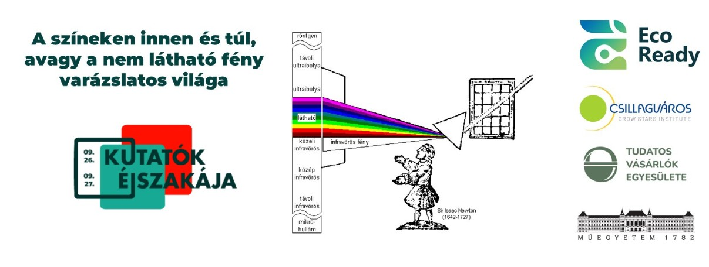

Tudtad, hogy a fehér fényben van a legtöbb szín? És hogy mi van ott, amit nem látunk, a vörös alatt és az ibolyán túl? Elég jó a szemed, hogy lásd az árnyalatnyi különbségeket? És ha elfárad, hogy látnak a gépek helyetted? A színeken inneni és túli világokat is bemutatjuk olyan példákon keresztül, ami minden nap körülvesz - hogy láss, ne csak nézz.

**Laborlátogatás** keretében a műszaki és a természettudományok (fizika, kémia, biológia és matematika) metszetében mutatjuk be a látható (Vis), a közeli és középinfravörös (NIR és MIR), valamint az ibolyántúli (UV) tartomány alkalmazhatóságát. Egyszerű, a résztvevők által is elvégezhető kísérletekkel szemléltetjük, hogyan működik a távirányító (NIR), hogyan ellenőrizhető a bankjegyek és a tabletták eredete (UV), hogyan bontja fel a fehér fényt a prizma, ill. szűrhető ki egy-egy szín (Vis). **Bemutató** jelleggel infravörös spektroszkópiai mérések végezhetők sokváltozós adatelemzéssel készült matematikai modellekkel például különböző magvak (búza, kukorica) fő alkotóinak (keményítő-, fehérje-, nedvesség-, olajtartalom) mennyiségi meghatározására (NIR), miközben a mikroszkóppal szövet, sejt szinten történhet képalkotás (Vis/NIR/MIR). **Kreatív foglalkozás** során színsorokat kell megfelelő sorrendbe tenni (például modellezve a növényi olajokat, színanyagokat) és színtévesztő teszteket lehet elvégezni (Vis). Kutató partnerünk mikrozöldségek **kóstoló**jával is kedveskedik, miközben bemutatják, hogy működik egy vertikális farm, s milyen szerepük van a látható és a nem látható fényeknek a hidroponikus termesztési, technológiájukban.

Kutatócsoportunk az EcoVita Living Lab keretén belül a Csillagváros Kft.-vel és a Tudatos Vásárlók Egyesületével együttműködve szolgálja a tudományos szféra, az ipar és a civil társadalom kapcsolódását. Az EcoVita Living Lab - https://www.eco-ready.eu/living-labs/ecovita/ - azt vizsgálja, hogy a vertikális gazdálkodás, mint a mezőgazdaság sajátos formája hogyan járulhat hozzá az élelmezésbiztonsághoz, az éghajlatváltozással szembeni ellenálló képességhez és az agrobiodiverzitáshoz. Célja az élelmiszerrendszer szisztematikus és gyakorlatorientált jellemzése, valamint a meglévő struktúrával kapcsolatos hiányosságok és adatigények elemzése, erősítve a fenntarthatóság társadalmi-gazdasági és környezeti pilléreit.

Az ECO-Ready projekt az Európai Unió HORIZON-CL6-2022 kutatási és innovációs programjából kapott támogatást a No. 101084201 számú támogatási megállapodás alapján.

[Dr. Gergely Szilveszter](https://tudprog.bme.hu/kutatok_ejszakaja/profilok/gergely_szilveszter),	[Slezsák János](https://tudprog.bme.hu/kutatok_ejszakaja/profilok/slezsak_janos),	[Madács Ágnes](https://tudprog.bme.hu/kutatok_ejszakaja/profilok/madacs_agnes),	[Prof. Salgó András](https://tudprog.bme.hu/kutatok_ejszakaja/profilok/salgo_andras)

[BME VBK, Alkalmazott Biotechnológia és Élelmiszertudományi Tanszék](https://kutatok.org/abettt/)

