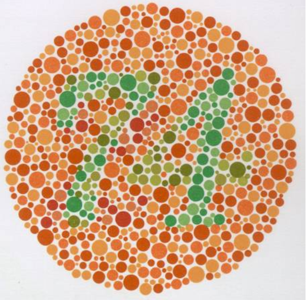

 Magyar világszabadalom lett a színtévesztés korrigálása színszűrős szemüvegekkel. A program keretében a jelentkező színtévesztők diagnosztizálásra kerülnek, utána pedig kipróbálhatják a színtévesztést korrigáló szemüvegeket.
 
A **vizsgálat + a korrigálás** ideje nagyjából 15 percet vesz igénybe.

*A programokra 1 fő jelentkezhet és 1 kísérőt vihet magával.*

 [Dr.habil Ábrahám György professor emeritus](https://tudprog.bme.hu/kutatok_ejszakaja/profilok/abraham_gyorgy.html)

 
