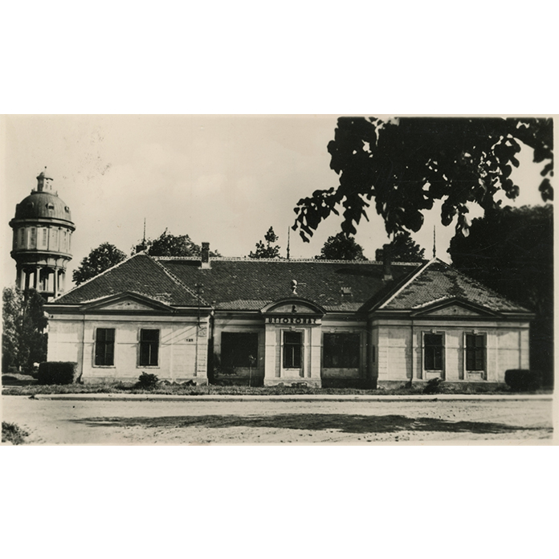

A sétán a Szombathelyi Brenner-villa és park múltjával ismerkedhetnek meg a résztvevők. A villa felújítása kapcsán archív képeken, a múlt elemeinek felderítésével tárul fel a Brenner család villájának és kertjének története. 

Gácsi Zsuzsanna

BME ÉPK, Középülettervezési tanszék

