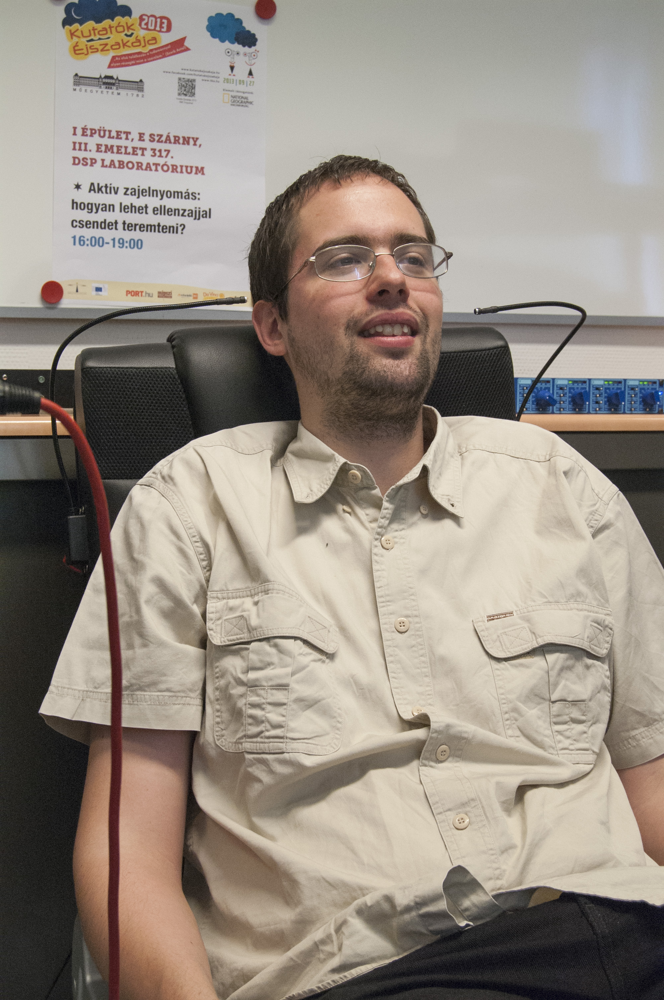

Laboratóriumunkban mindenki saját fülével győződhet meg látványos formában az eljárás működőképességéről. 
Az aktív zajcsökkentés alapja, hogy olyan "másodlagos" zajt kell létrehozni, amely a kívánt helyen az eredeti "elsődleges" zajjal interferálva, kioltja azt.

[Dr. Sujbert László](https://tudprog.bme.hu/kutatok_ejszakaja/profilok/sujbert_laszlo), [Ország Bence](https://tudprog.bme.hu/kutatok_ejszakaja/profilok/orszag_bence)

[Mesterséges Intelligencia és Rendszertervezés Tanszéket](https://www.mit.bme.hu/)

