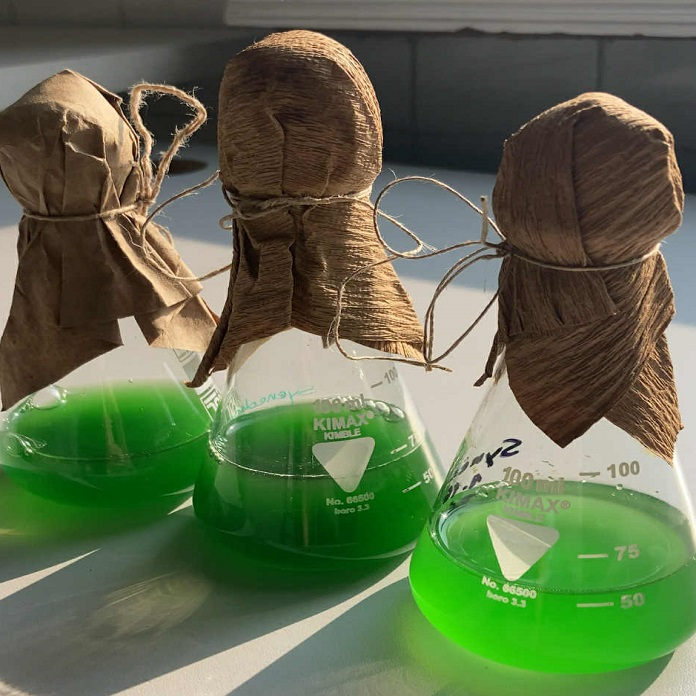

Kíváncsi vagy, hogy milyen apró élőlények vesznek minket körül?  Te láttál már vizibolhát? 
Tudod, hogy néz ki egy élesztőgomba a mikroszkóp alatt? Tudtad, hogy van olyan baktérium, ami képes világítani? Gyere, és ismerd meg a BME Környezeti Mikrobiológia és Környezettoxikológia laboratoriumának titkait!

[Márton Rita](https://tudprog.bme.hu/kutatok_ejszakaja/profilok/marton_rita), [Kese István](https://tudprog.bme.hu/kutatok_ejszakaja/profilok/kese_istvan),	[Lassu Dominika](https://tudprog.bme.hu/kutatok_ejszakaja/profilok/lassu_dominika)

BME VBK, Alkalmazott Biotechnológia és Élelmiszertudományi Tanszék

