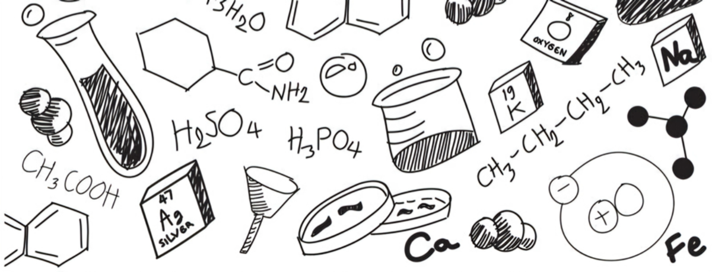

A Szent-Györgyi Albert Szakkollégium tagjai izgalmas, interaktív kísérleti bemutatóval készültek nektek az idei Kutatók Éjszakájára. 
Kicsiknek és nagyoknak egyaránt szórakoztató lesz az előadás, reméljük, minél többetekkel találkozunk majd szept. 26-án!

