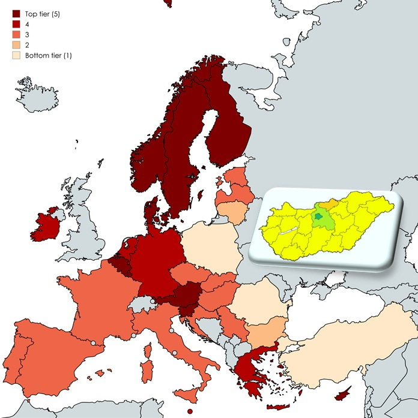

Az előadás áttekinti a legfontosabb digitális országrangsorokat, bemutatja, hogyan mérik a digitális fejlettséget, és milyen lehetőségeket kínálnak ezek a mutatók a digitális átalakulás értékelésében.

[Bánhidi Zoltán](https://tudprog.bme.hu/kutatok_ejszakaja/profilok/banhidi_zoltan)

