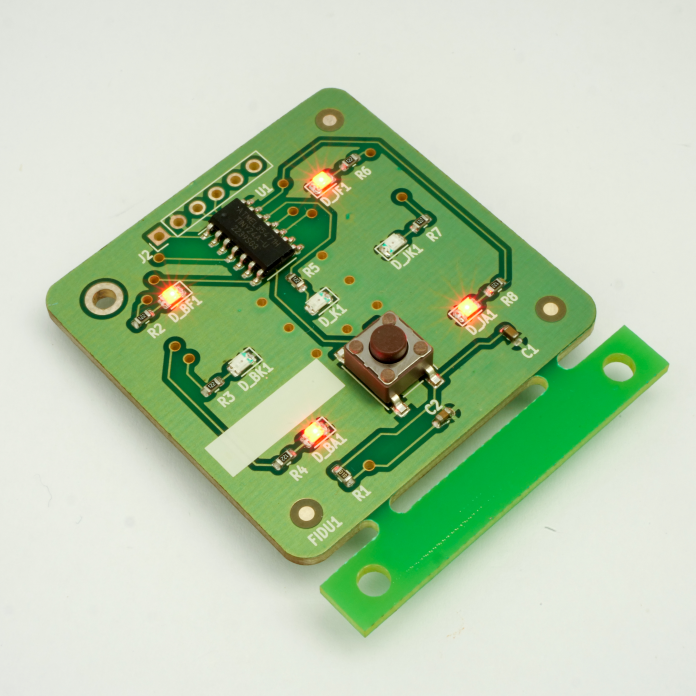

Elgondolkodtál már azon, hogy készülnek az elektronikus áramkörök? Hogyan készül a mobiltelefon vagy a mosógép vezérlőlapja? Akkor itt a helyed nálunk! 
A program során bemutatjuk egy egyszerű áramkörrel, hogyan épül fel a felületszerelési technológia, hogyan lesz a sok bezacskózott alkatrészből a végén egy működő villogó digitális dobókocka!

**A programra a helyszíni regisztráció a V1 épület aulájában történik.** A látogatókat minden óra egészkor engedjük be a laboratóriumba. Egy turnusban maximum 20 fő vehet részt. 

*A regisztráció helyszínén kollégáink és hallgatóink kézzel is megfogható kütyükkel, érdekességekkel várják a látogatókat.*

[Bátorfi Réka](https://tudprog.bme.hu/kutatok_ejszakaja/profilok/batorfi_reka.html), [Takács Gergő](https://tudprog.bme.hu/kutatok_ejszakaja/profilok/takacs_gergo.html),	[Havellant Gergő](https://tudprog.bme.hu/kutatok_ejszakaja/profilok/havellant_gergo.html), [Tafferner Zoltán](https://tudprog.bme.hu/kutatok_ejszakaja/profilok/tafferner_zoltan)

[BME VIK, Elektronikai Technológia Tanszék](https://www.ett.bme.hu/)

