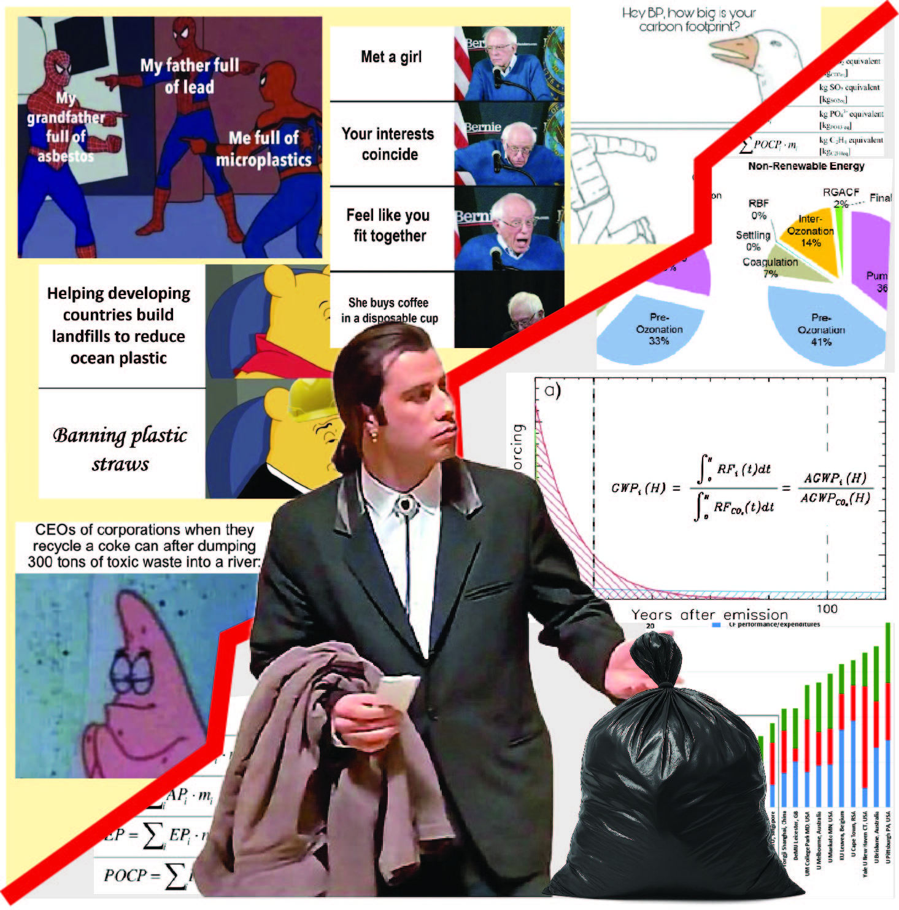

Interaktív műhelyünkben hulladékgazdálkodási játékra invitálunk, amely során te irányítod a hulladék útját, tesztelheted tudásod, és közben megismerheted a hulladékkezelés, hulladékhasznosítás, újrahasznosítás és fenntarthatóság kevésbé ismert oldalait.

[Dr. Tóth Csenge](https://tudprog.bme.hu/kutatok_ejszakaja/profilok/toth_csenge)

