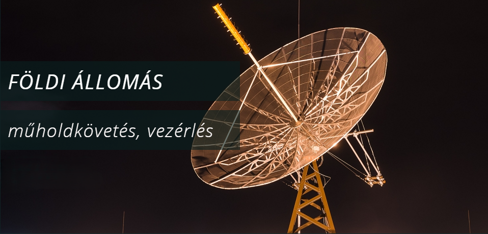

Előadók:
- **dr. Dudás Levente:** egyetemi adjunktus, a BME oktatási műhold projektek műszaki vezetője
- **Herman Tibor:** doktorandusz
- **Hödl Emil:** tudományos segédmunkatárs
- **Püspöki Péter:** doktorandusz

BME Etető, avagy földi műhold vezérlő állomás és az oktatási műhold fejlesztéseink bemutatása: Masat-1, SMOG-P, ATL-1, SMOG-1, MRC-100, Hunity (NMHH-1)

