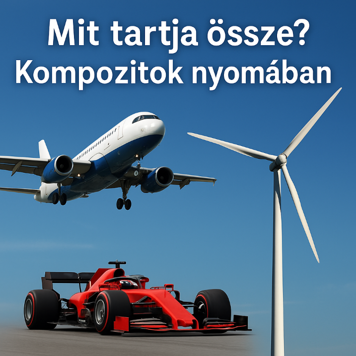

Mi köti össze az eget, a versenypályát és a szél energiáját? A polimer kompozit, amely nélkül ma nem repülnének repülők, nem száguldanának Forma–1-es autók és nem foroghatnának szélturbinák. Laborlátogatásunkon felfedjük titkaikat és izgalmas kísérletekkel mutatjuk be viselkedésüket.

[Balogh Fanni](https://shorturl.at/4LvT4), [Dr. Czél Gergely](https://shorturl.at/90aEL), [Dr. Pomázi Ákos](https://shorturl.at/kKSk9), [Marton Gergő Zsolt](https://bit.ly/4p8WUtw), [Kiss Lóránt](https://bit.ly/4g7d6r5)

[BME GPK, Polimertechnika Tanszék](http://www.pt.bme.hu/fooldal.php?l=m)

