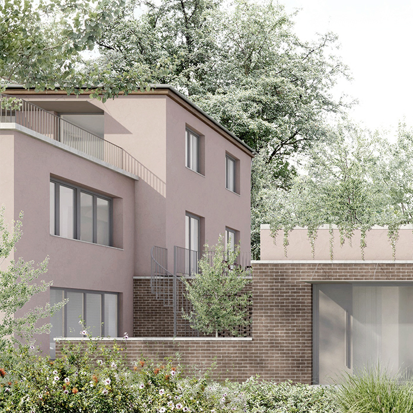

Árkay Bertalan egyik védelemmel nem rendelkező, ám építészi értékekkel bíró házának megújításával és bővítésével foglalkoztunk az elmúlt egy évben.
Habár a meglévő ház állapota leromlott, főbb terei bejárhatók, abban a terveket kiállítva, a megbízó és tervező szándékai bemutathatók.

[Batizi-Pócsi Péter](https://tudprog.bme.hu/kutatok_ejszakaja/profilok/batizi_pocsi_peter), 
[Batizi-Pócsi Gergő](https://tudprog.bme.hu/kutatok_ejszakaja/profilok/batizi_pocsi_gergo)

[BME ÉPK, Középülettervezési Tanszék](https://kozep.bme.hu/)

