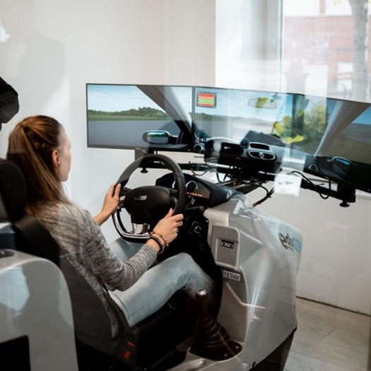

Fedezd fel a közlekedés jövőjét a Kutatók Éjszakáján! Ismerd meg testközelből a modern járműszimulátor alkalmazási lehetőségeit, amely biztonságos és valósághű környezetben mutatja be, hogyan reagálunk váratlan forgalmi helyzetekre. Kipróbálhatod, milyen hatással van a figyelem, a stressz vagy akár a vezetési stílus a baleseti kockázatra, az üzemanyag-fogyasztásra és a károsanyag-kibocsátásra. A szimulátor nemcsak kutatási eszköz, hanem élmény is: interaktív módon láthatod, hogyan formálhatja a technológia a fenntartható közlekedést és a közlekedésbiztonságot. 
Egyedülálló lehetőség, hogy játékosan tanulj, és bepillants a jövő közlekedéstudományába!

Dr. Sipos Tibor, Göntér Ábel

