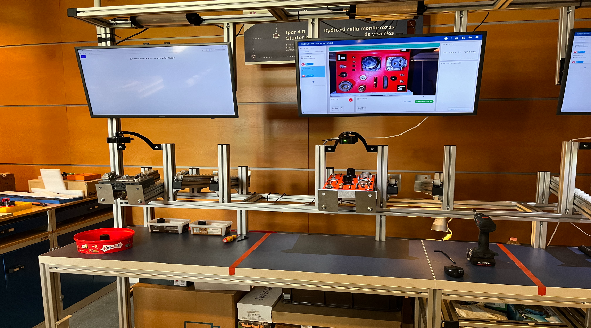

Az Ipar 4.0 Technológiai Központ a Knorr-Bremse vállalattal közösen fejlesztett egy gépi látáson alapuló, szerelősor monitorozó alkalmazást, melyet folyamatosan fejleszt. 
Az alkalmazást a TK-ban egy teszt szerelősoron mutatjuk be, ahol egy LEGÓ összeszerelését próbálhatják ki a résztvevők, miközben folyamatosan követjük a szerelési folyamatot.

[Kovács László](https://tudprog.bme.hu/kutatok_ejszakaja/profilok/kovacs_laszlo)

BME VIK, Ipar 4.0 Technológiai Központ

