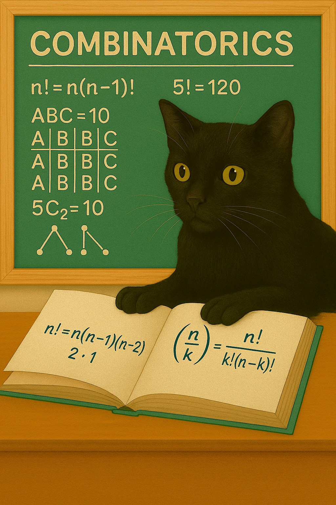

Modern számfogalmaink kialakulásában az összességek, mint jelenségek felismerésének és a velük való érintkezéseknek kulcssszerepük volt. Habár a különböző szám- és számosságfogalmak a véges sok tagból álló összesség szemléletétől izgalmas irányokba rugaszkodtak el, a "jó öreg" véges halmazok és elemszámaik bőven tartogatnak még meglepetéseket. 
Előadásomban konkrét, szemléletes modelleket vizsgálok, megmutatom, hogyan írhatók le az azok kapcsán előbukkanó véges halmazok és hogy mit lehet mondani az elemszámaikról.

[Szabó Zsolt](https://tudprog.bme.hu/kutatok_ejszakaja/profilok/szabo_zsolt)

[BME TTK, Matematika Intézet](https://math.bme.hu/)

