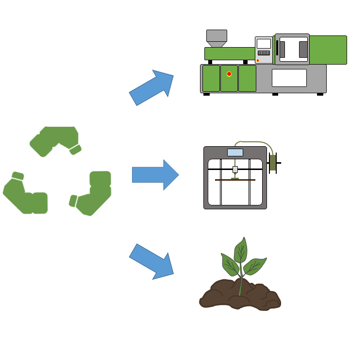

Az esemény során a látogatók megismerkedhetnek a műanyagok mechanikai újrahasznosításának lépéseivel, láthatják, hogy milyen termékek készülhetnek az összegyűjtött szelektív hulladékból. 
Emellett a látogatók átfogó képet kaphatnak a biopolimerekről, illetve ezek komposztálhatóságáról.  
A program kapcsolódik a Polimertechnika Tanszék MT épületi laboratóriumában megrendezésre kerülő többi programhoz.

[Dr. Gere Dániel](https://tudprog.bme.hu/kutatok_ejszakaja/profilok/gere_daniel), [Kovács Zsófia](https://tudprog.bme.hu/kutatok_ejszakaja/profilok/kovacs_zsofia),	[Dr. Krizsma Szabolcs Gábor](https://tudprog.bme.hu/kutatok_ejszakaja/profilok/krizsma_szabolcs),	[Dr. Bordácsné Bocz Katalin](https://tudprog.bme.hu/kutatok_ejszakaja/profilok/bordacsne_bocz_katalin),	[Ötvös Bettina](https://tudprog.bme.hu/kutatok_ejszakaja/profilok/otvos_bettina),	Dremák Csenge

[BME, GPK, Polimertechnika Tanszék](http://www.pt.bme.hu/fooldal.php?l=m)

