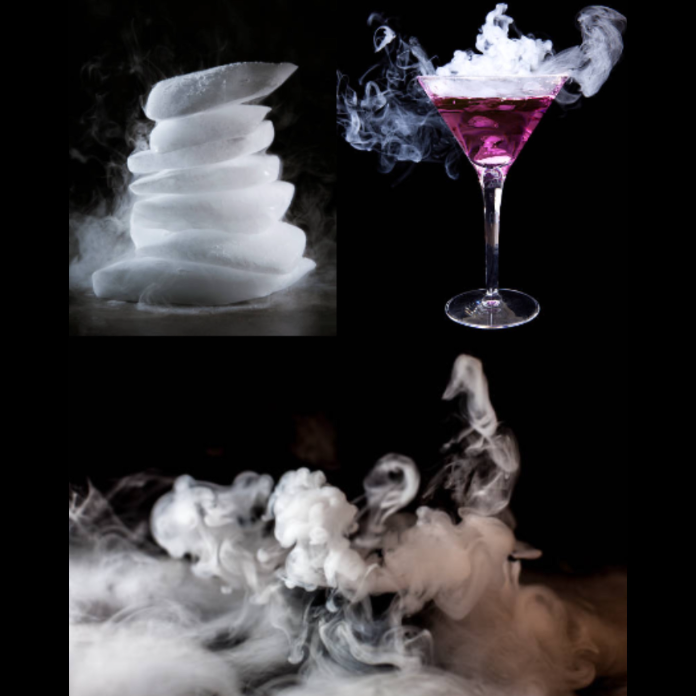

Fedezd fel a hűtéstechnika csodáit izgalmas kísérletek során! A programon választ kaphatsz arra, hogy hogyan lehet irányítani a hőmérsékletet különböző technikai megoldásokkal. 
Tudd meg, hogyan hűsít a tudomány!

Kardos Réka, Rácz Erika

[Energetikai Gépek és Rendszerek Tanszék](https://www.energia.bme.hu/)

