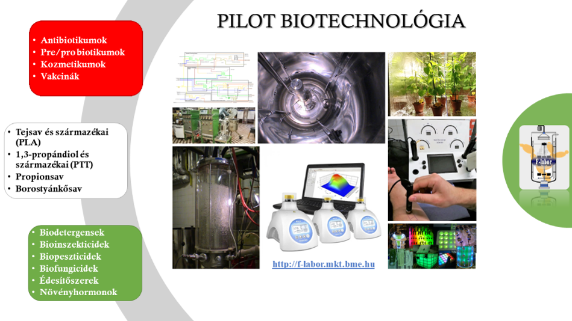

A látogatás során bemutatjuk, hogy az alaptudományok (kémia, biokémia, biológia) folyamatai és jelenségei hogyan befolyásolják a termelő biotechnológiai folyamatokat. 
Milyen szabályozástechnikai trükkökkel lehet például rávenni a hétköznapi élesztőt, hogy alkohol helyett biomasszát termeljen vagy egy algát, hogy a napfény helyett ecetet egyen, 
hogyan lehet baktériumokkal és gombákkal kozmetikumokat édesítőszereket előállítani.
A látogatók kipróbálhatják a mikroszkópozást, a steril technológiai mintavételezést, a kozmetikai méréseket és megállapítjuk, kinek a „legpiszkosabb” a keze 😊

During the visit we introduce, how processes and phenomenon’s of basic sciences (like chemistry, biochemistry and biology) affect the production of bioprocesses. 
What controlling tricks can lead the simple and common baker’s yeast to produce biomass instead of alcohol or some algae to consume acetic acid instead of utilizing sunshine, 
or how it possible to manufacture cosmetics and sweeteners with bacteria and fungi. Visitors can try microscopes, taking aseptic samples from pilot facility, cosmetic measurements, 
and we will demonstrate, who has the most dirtiest hands 😊

Az esemény a BME Alkalmazott Biotechnológia és Élelmiszertudományi Tanszékén megrendezésre kerülő **"Legyél te is biomérnök!"** programsorozat része.

[Dr. Németh Áron](https://tudprog.bme.hu/kutatok_ejszakaja/profilok/nemeth_aron), [Dr. Kiss Bernadett](https://tudprog.bme.hu/kutatok_ejszakaja/profilok/kiss_bernadett), [Eszterbauer Edina](https://tudprog.bme.hu/kutatok_ejszakaja/profilok/eszterbauer_edina)

