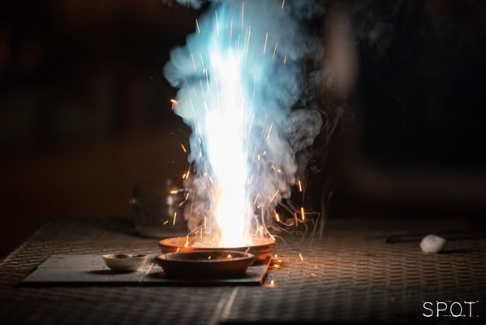

Látványos kémiai kísérleteket láthatnak az érdeklődők. A központban a fényjelenséggel, füsttel járó folyamatok lesznek, amelyek nagy részét elsötétítés mellett élvezheti a közönség.

[Rapi Zsolt](https://tudprog.bme.hu/kutatok_ejszakaja/profilok/rapi_zsolt)

[BME VBK, Szerves Kémia és Technológia Tanszék](https://oct.bme.hu/oct/hu)

