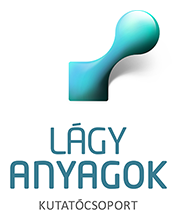

Az érdeklődők megismerkedhetnek különböző viszkoelasztikus anyagokkal és azok tulajdonságainak vizsgálatára alkalmas műszerekkel (reométer, szakítógép) egy játékos laborlátogatás során.

[Dőtsch Anna Angyalka](https://tudprog.bme.hu/kutatok_ejszakaja/profilok/dotsch_anna_angyalka),	[Mihalovics Bence](https://tudprog.bme.hu/kutatok_ejszakaja/profilok/Mihalovics_Bence),	[Nguyen Zsófia Ly](https://tudprog.bme.hu/kutatok_ejszakaja/profilok/nguyen_zsofia_ly),	[Szabó Domonkos](https://tudprog.bme.hu/kutatok_ejszakaja/profilok/szabo_domonkos),	[Szayly Kata](https://tudprog.bme.hu/kutatok_ejszakaja/profilok/szayly_kata)

BME VBK, Fizikai Kémia és Anyagtudományi Tanszék

