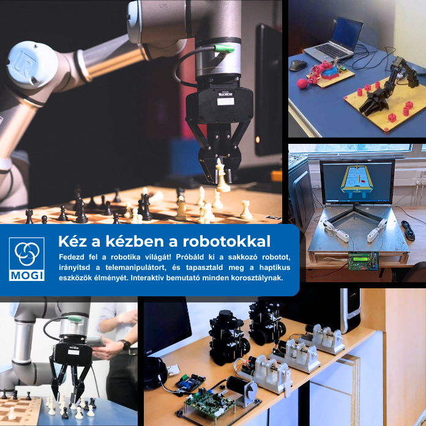

Fedezd fel a robotika világát! Próbáld ki a sakkozó robotot, irányítsd a telemanipulátort, és tapasztald meg a haptikus eszközök élményét. Interaktív bemutató minden korosztálynak.

Dr. Budai Csaba, Bertók Zsanett, Nagy Vanda Orsolya, Haba Tamás

BME GPK, Mechatronika, Optika és Gépészeti Informatika Tanszék

