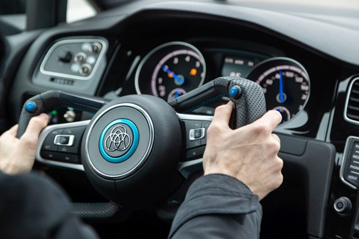

Ebben a demóban azt mutatjuk meg, hogy a veztésben milyen informatikai megoldások felelősek a könnyű és biztonságos irányváltásért, és ezen megoldásoknak miként lehet garantálni a megfelelő működését. 
Bemutatjuk egy modern kormány informatikai rendszereit és ezek működését. 
A demó a BME és a thyssenkrupp Kft.  Kompetencia Központban végzett munkáját mutatja be.

[Dr. Vörös András](https://www.mit.bme.hu/munkatarsak/vori)

[BME VIK, Méréstechnika és Információs Rendszerek Tanszék](https://www.mit.bme.hu/)

