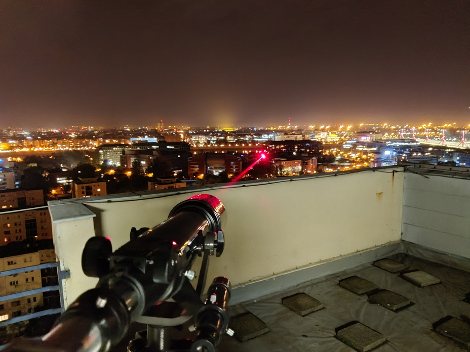

Az információ biztonságos továbbítását biztosító kvantumkommunikációs rendszerek működésének alapját bonyolult elméletek igazolják. Célunk közérthetően, látványos kísérletekkel közelebb hozni a kvantumkommunikáció világát az érdeklődőkhöz. 
A bemutató során saját fejlesztésű kvantumos elvű kulcsszétosztó berendezéseket és véletlenszámgenerátort mutatunk be. Kíváncsi vagy, hogyan lehet összefonódott fotonpárokat megosztani a Duna fölött? 
Vagy kvantumos információt küldeni egy optikai hálózaton? Laborunkban megtudhatod. 

Dr. Schranz Ágoston Kristóf: Villamosmérnök, egyetemi adjunktus. Fő kutatási területe az optikai elvű kvantum-véletlenszámgenerálás

[BME-VIK, Hálózati Rendszerek és Szolgáltatások Tanszék](https://www.hit.bme.hu/)

