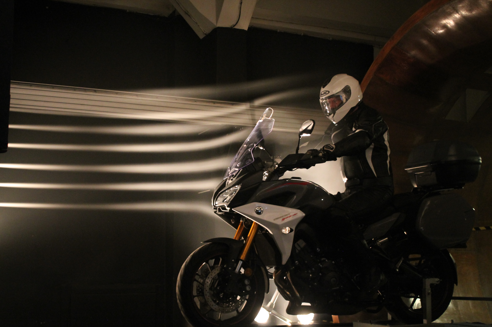

Megismerkedhetnek a szélcsatornás mérésekkel és érdekes áramlástani sajátosságokkal. Lehetőség van beállni a szélcsatorna közel 90 km/h sebességű levegőáramába. 
Továbbá látványos áramlástani bemutatók tekinthetők meg.

**Szélcsatorna bemutatók kezdete:** 18:30, 19:30, 20:30, 21:30

[Dr. Tokaji Kristóf](https://tudprog.bme.hu/kutatok_ejszakaja/profilok/tokaji_kristof)

[Áramlástan Tanszék](https://www.ara.bme.hu/), [Áramlástan Szakosztály](https://www.facebook.com/aramlastanszakosztaly)

