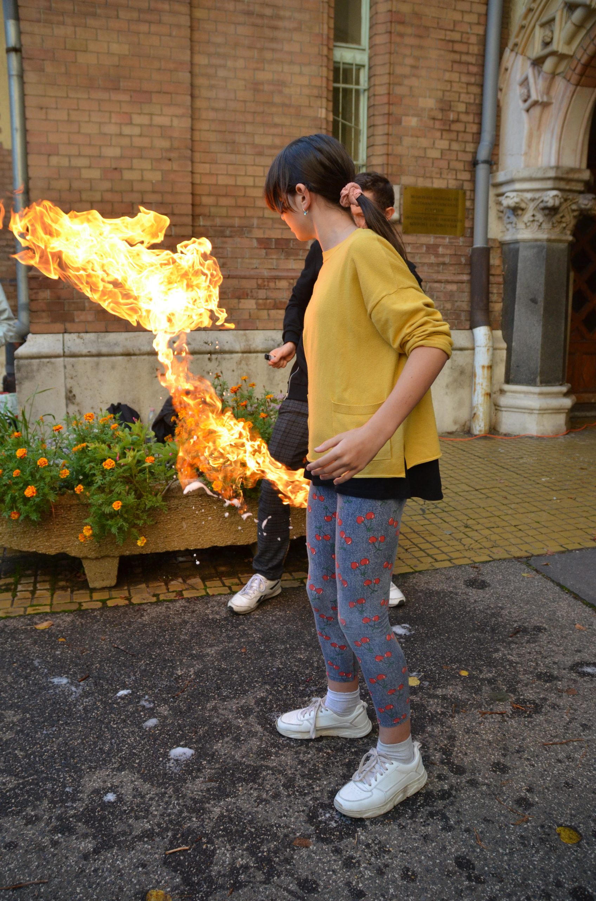

Kicsiket és nagyokat egyaránt szeretettel várunk, hogy megismerkedjenek a fizika varázslatos világával. 
Kísérleteink a folyékony levegő fagyosságától a tomboló lángok forróságáig terjednek, továbbá felölelik a szikrázó elektromosságot, különböző rakétákat és még sok mást.

Bednanics Hanna

[BME TTK Wigner Jenő Szakkollégium](https://wjsz.ktk.bme.hu/)

