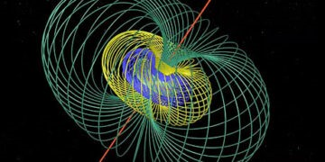

A kiállítás anyagát Pintér Gergő matematikus hallgatói készítették az előadásai, foglalkozásai  nyomán. A munkákat Pintér Gergő könyvei és lemezei  ihlették. 
Az interaktív kiállításra laikusokat és szakembereket egyaránt várnak a szerzők. Az egyes alkotások  bemutatását, megértését maguk a hallgatók is segítik.

Keszthelyi Gabriella, [Pintér Gergő](https://tudprog.bme.hu/kutatok_ejszakaja/profilok/pinter_gergo)

