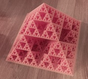

A látogatók érdekes feladatokon, fejtörőkön keresztül próbára tehetik magukat. Új ismereteket szerezhetnek a matematika különböző területeiről a lelkes matematikus hallgatóktól.

[Eper Miklós](https://tudprog.bme.hu/kutatok_ejszakaja/profilok/eper_miklos)

[BME TTK Matematika Intézet](https://math.bme.hu/)

