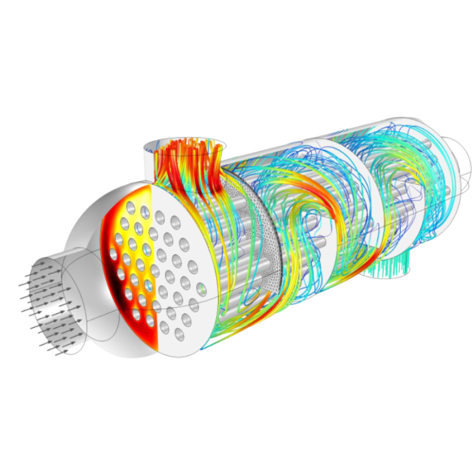

Légy részese a szimulációk izgalmas világának! 
Interaktív programunk során bemutatjuk, miért és hogyan használják a szakemberek a szimulációs technikákat a tervezésben és problémamegoldásban, majd te magad is kipróbálhatod mindezt.

Kardos Réka, Rácz Erika

[Energetikai Gépek és Rendszerek Tanszék](https://www.energia.bme.hu/)

