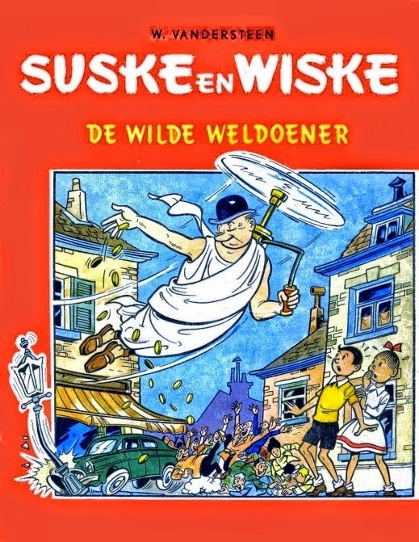

Kell-e engedélyt kérni a paródiához, ha egy zenekar lemezborítóját használja valaki, kis átalakítással kampányplakátként, vagy ha egy film ikonikus jelenetének szövegét helyettesíti be vicces szöveggel?
Hol a határ a Superman képregények újabb és újabb epizódjai és egy HVG címlap között? Mi történik, ha élő embert parodizálnak és mi, ha egy fiktív karaktert? Na és mi a helyzet az (egyáltalán) nem vicces paródiákkal? Más-e a megítélés,
ha egy híres márka paródiája készül el? Ezekre a kérdésekre számtalan válasz adható, és még a jogi válaszok is sokfélék. Ezeket mutatjuk be, vitatjuk meg, remélhetőleg a közönség véleményét is megismerve. 

**Előadók:** Dr. Grad-Gyenge Anikó habil. Egyetemi docens, BME GTK, dr. Faludi Gábor egyetemi docens, ELTE ÁJK, dr. Keserű Barna Arnold egyetemi docens, SZE ÁJK, dr. Mezei Péter egyetemi tanár SZTE ÁJK, dr. Ujhelyi Dávid egyetemi adjunktus PPKE JÁK

