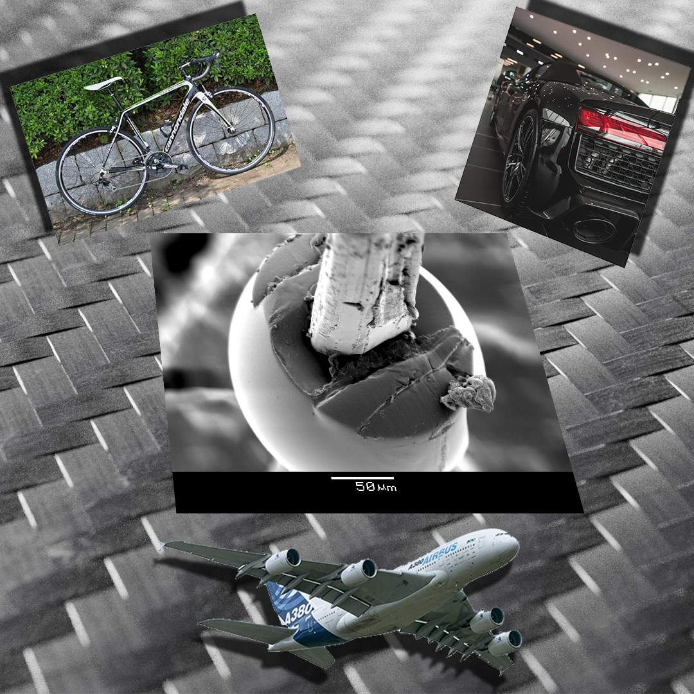

Miért használnak polimer kompozitokat a repülőgépek, versenyautók, versenybiciklik gyártásánál? Miben tud többet (vagy éppen kevesebbet) a szénszál a fémeknél? 
Hogyan vizsgálják és mi alapján minősítik ezeket az erősítőanyagokat? Még csak a sorozatokban hallottál elektronmikroszkópról? Itt az idő, hogy ez megváltozzon!

[Pinke Balázs Gábor](https://tudprog.bme.hu/kutatok_ejszakaja/profilok/pinke_balazs_gabor), [Dr. Morlin Bálint](https://tudprog.bme.hu/kutatok_ejszakaja/profilok/morlin_balint)

[BME GPK, Polimertechnika Tanszék](http://www.pt.bme.hu/fooldal.php?l=m)

