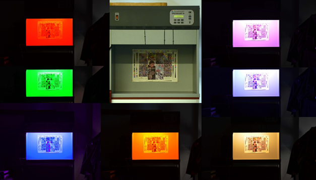

Mi a szín? 
Hogyan változik a tárgyak színe különböző környezetekben? 
Mi történik a tárgyak színével, ha színes LED-ek fénye alatt nézzük őket? 

Keressük együtt a válaszokat a MOGI Tanszék optika laborjaiban, ahol érdekes kísérletekkel és vizsgálatokkal várjuk az érdeklődőket.

[Nagy Balázs Vince](https://tudprog.bme.hu/kutatok_ejszakaja/profilok/nagy_balazs_vince.html), [Urbin Ágnes](https://tudprog.bme.hu/kutatok_ejszakaja/profilok/urbin_agnes.html)

[BME GPK Mechatronika, Optika és Gépészeti Informatika Tanszék](https://mogi.bme.hu/)

