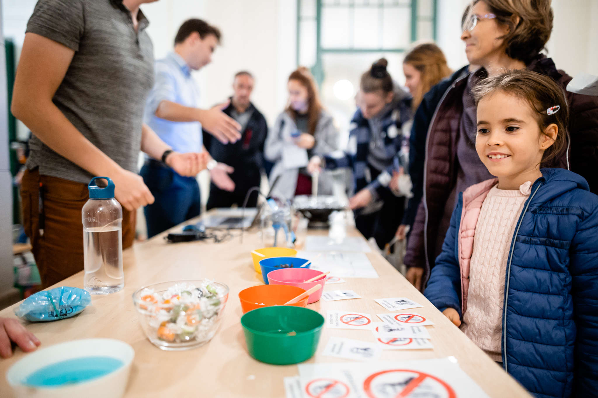

Az áramlástannal bárhol találkozhatunk legyen az sütikészítés, zenehallgatás, vérnyomásmérés, művészet vagy műszaki alkalmazások. 
Kísérleteinket játékos formában mutatjuk be a napelemes hajón és akusztikán át, a nemnewtoni folyadékokig.  

[Till Sára](https://tudprog.bme.hu/kutatok_ejszakaja/profilok/till_sara), [Dr. Gyürki Dániel](https://tudprog.bme.hu/kutatok_ejszakaja/profilok/gyurki_daniel), [Friedrich Péter](https://tudprog.bme.hu/kutatok_ejszakaja/profilok/friedrich_peter), [Sándor Levente Gábor](https://tudprog.bme.hu/kutatok_ejszakaja/profilok/sandor_levente_gabor), [Balog Boglárka](https://tudprog.bme.hu/kutatok_ejszakaja/profilok/balog_boglarka)

[BME GPK, Hidrodinamikai Rendszerek Tanszék](https://www.hds.bme.hu/tanszek.php?)

