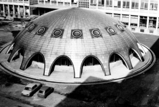

A BME Nukleáris Technikai Intézet Oktatóreaktorának megtekintése. Rövid, kb. fél órás előadás ismerteti a reaktor működésének fizikai alapjait. Ezután megmutatjuk a reaktorépület egyes részeit, működési funkcióit.

[Zsíros Gábor](http://www.reak.bme.hu/munkatars/oktatok/zsiros-gabor.html)

[BME TTK, Nukleáris Technikai Intézet](https://www.reak.bme.hu/)

