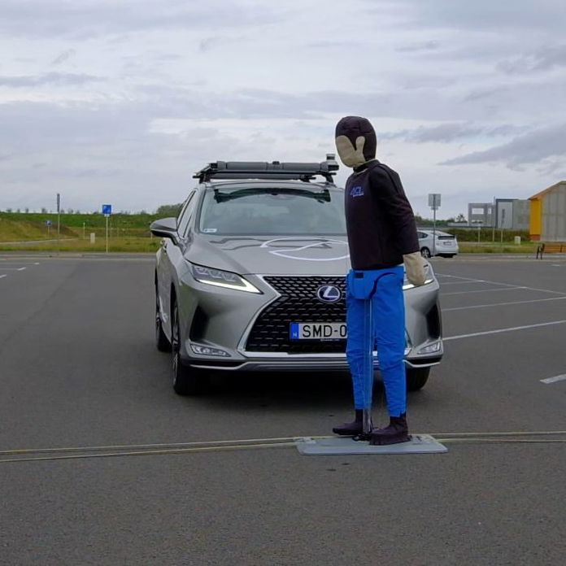

A látogatók megtekinthetik az Autonóm Rendszerek Nemzeti Laboratórium által fejlesztett Lexus RX450h önvezető tesztautót, 
amellyel egy automatizált „valet parking” funkció kerül bemutatásra. Emellett kötetlen beszélgetést folytathatnak szakértőinkkel az önvezető járművek fejlesztéséről.

[Dr. Aradi Szilárd](https://tudprog.bme.hu/kutatok_ejszakaja/profilok/aradi_szilard), [Dr. Fehér Árpád](https://tudprog.bme.hu/kutatok_ejszakaja/profilok/feher_arpad)

[BME KJK, Közlekedés- és Járműirányítási Tanszék](https://kjit.bme.hu/index.php/hu/)

