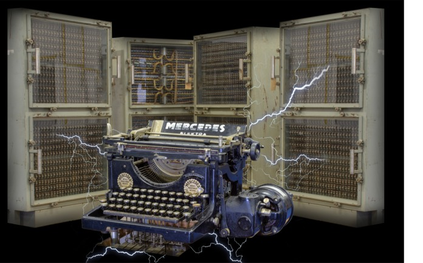

Programunk az 1950-es évekbe repíti vissza: megismerheti Magyarország első elektromechanikus számítógépének történetét, a róla ismert és máig rejtélyes részleteket, sőt az újonnan elkészített részegységeit ki is próbálhatja. 
Ld. még www.mesz-i.org

[Dr. Németh Krisztián](https://tudprog.bme.hu/kutatok_ejszakaja/profilok/nemeth_krisztian), [Sziva Hanna](https://tudprog.bme.hu/kutatok_ejszakaja/profilok/sziva_hanna), [Vid Gábor](https://tudprog.bme.hu/kutatok_ejszakaja/profilok/vid_gabor), [Horváth Milán](https://tudprog.bme.hu/kutatok_ejszakaja/profilok/horvath_milan)

[BME VIK/Távközlési és Mesterséges Intelligencia Tanszék](https://www.tmit.bme.hu/)

