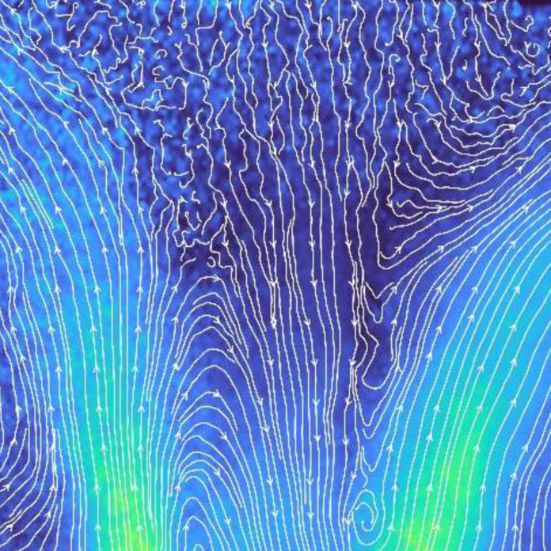

Hogyan tehetjük láthatóvá az áramlásokat? Most megfigyelhetsz egy égőben kialakuló sebességteret egy modern méréstechnika, a Particle Image Velocimetry segítségével. 
A program során megismerheted az eszköz működését és egy valós mérésben is részt vehetsz.

Kardos Réka, Rácz Erika

[Energetikai Gépek és Rendszerek Tanszék](https://www.energia.bme.hu/)

