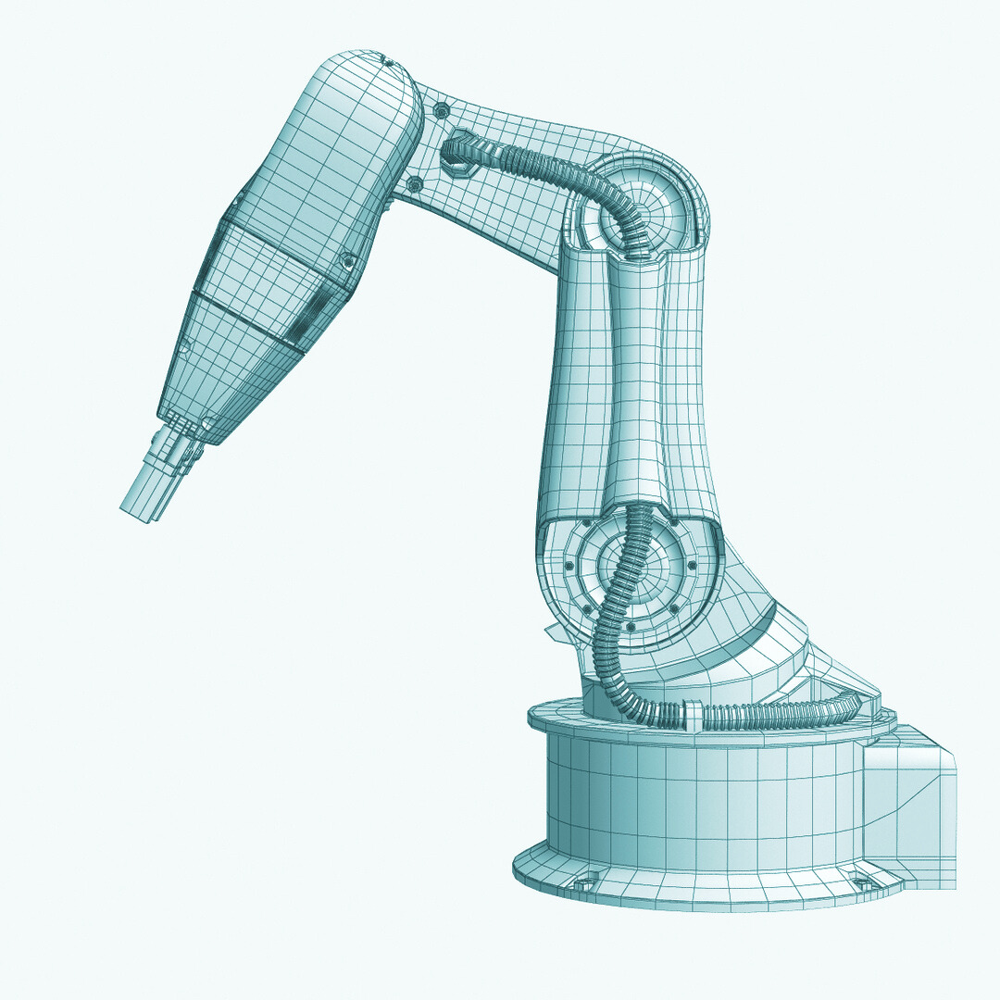

Robot apuka megkérdezi csemetéjét: - Ha nagy leszel, te is az iparban szeretnél majd dolgozni? 
Mire a kis robot öntudatosan: - Nem, én sebész leszek! 
Aki kíváncsi a részletekre, jöjjön el az előadásra...

Gerdán Mercédesz, Koszta Enikő

[BME TTK, Nukleáris Technikai Intézet](https://www.reak.bme.hu/)

