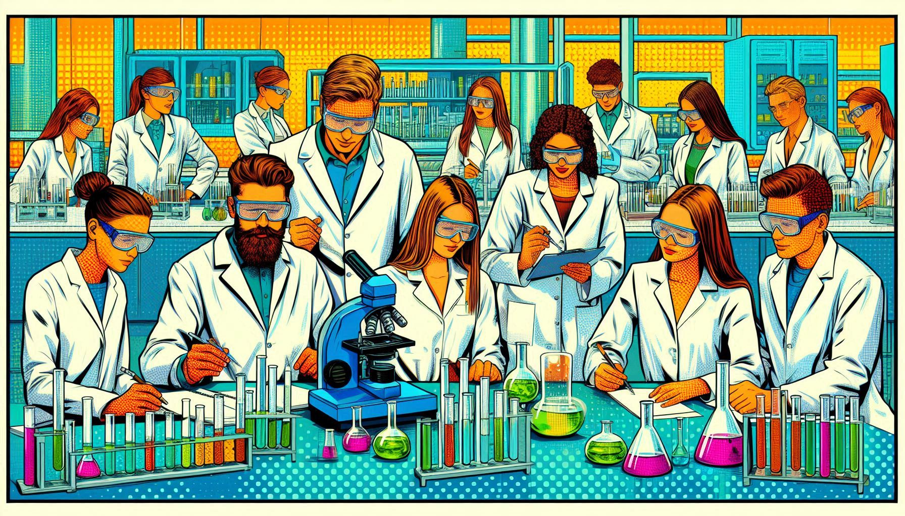

Szabaduló szoba (sőt, labor!) a Műegyetemen! Játékos feladatok megoldása során ismerkedhetsz a vízkémiával, vízanalitikával, vízi közművekkel és a vízhez kapcsolódó környezeti kérdésekkel. 
Közben betekintést nyerhetsz a tanszékünkön folyó munkákba is. Meg tudjátok oldani a Vízlabor rejtélyét? 

[Murányi Gábor](https://tudprog.bme.hu/kutatok_ejszakaja/profilok/muranyi_gabor)

[BME ÉMK, Vízi Közmű és Környezetmérnöki Tanszék](https://vkkt.bme.hu/)

