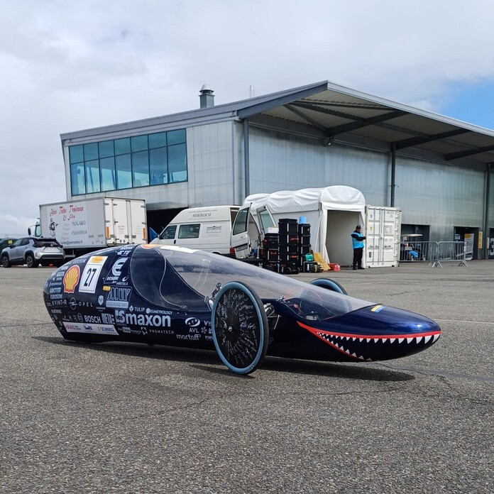

Érdekelnek a motorok? A program során megnézheted, hogy történik bennük az égés, megtudhatod hogyan hajthat meg motort pusztán egy csésze tea, és milyen messze jut egy fecskendőnyi üzemanyaggal egy BME-s versenycsapat autója. 
Nem elég? Van vízrakétánk is!

Kardos Réka, Rácz Erika

[Energetikai Gépek és Rendszerek Tanszék](https://www.energia.bme.hu/)

