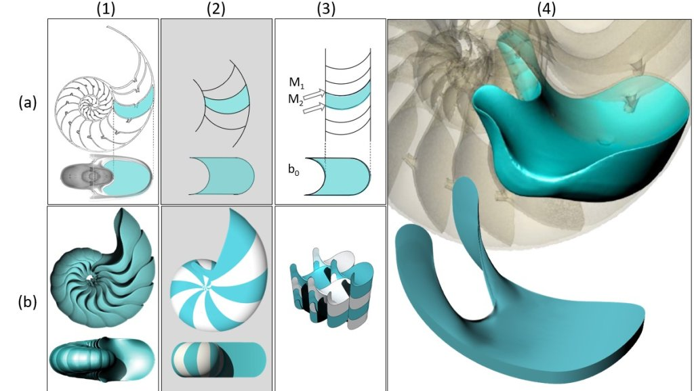

A tér kitöltésének geometriáján már Platón és Arisztotelész is vitatkozott. Az előadásban egyrészt azt mutatom meg, hogy a geológiában megfigyelt töredezett kövek formájának leírásához éppen ennek a vitának a megértése lehet a kulcs. 
A biológiában teljesen más térkitöltő formákat figyelhetünk meg: éles sarkok helyett lágy, lekerekített élek jelennek meg. 
A lágy cellák geometriai leírása  nem csak a biológiai formák mélyebb megértéséhez, de az AX-4  űrmisszió egyik legérdekesebb, leglátványosabb kísérletéhez is elvezet.

[Domokos Gábor](https://tudprog.bme.hu/kutatok_ejszakaja/profilok/domokos_gabor)

